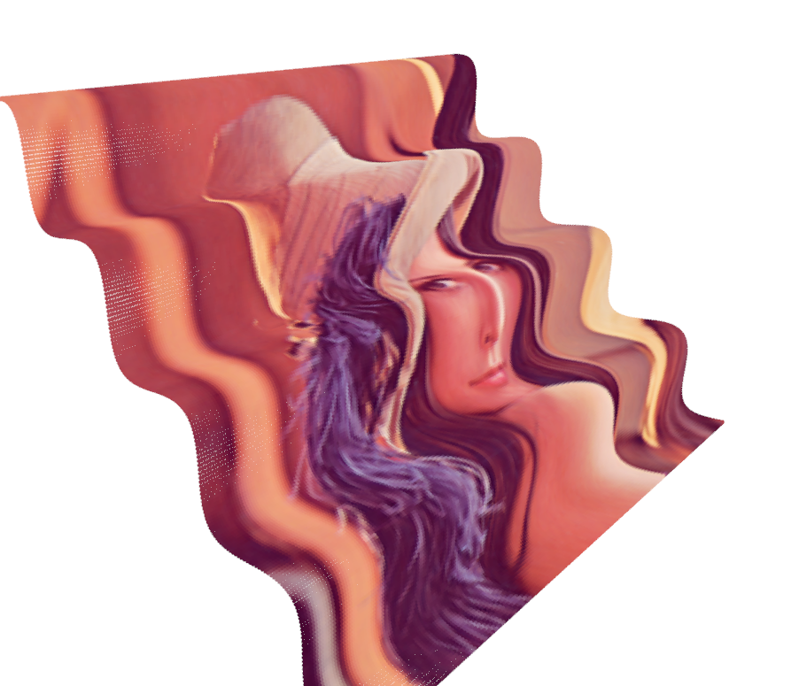
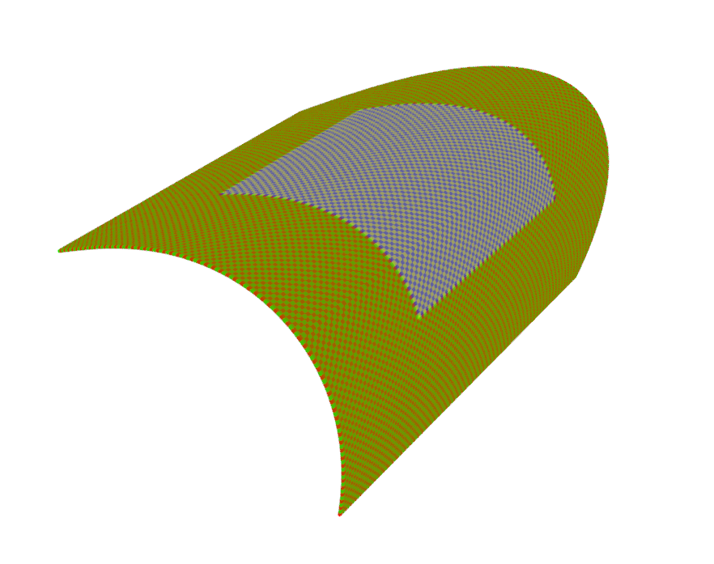

# image-to-pointCloud

At times I need very simple textured based pointclouds to do stuff like denoising, segmentation etc. This simple project aims 
to convert simple textured based images to 3d point clouds with some distortion.

# Results
Here see that how I converted the lena image into 3d point-cloud.

And a simple gimp-texture is converted to a point-cloud which shall be used later to segment the two textures.

