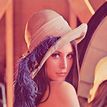

# image-to-pointCloud

At times I need very simple textured based pointclouds to do stuff like denoising, segmentation etc. This simple project aims 
to convert simple textured based images to 3d point clouds with some distortion.


# Results

> Here see that how I converted the lena image into 3d point-cloud.




> And a simple gimp-texture is converted to a point-cloud which shall be used later to segment the two textures.


# Usage

```bash
python image_To_pcd.py -i ./data/wood.png -d 1
```
> This should generate the .ply file in the working directory. The `-d` flag other than 1 means the image will not be distored.

> To choose the distortion type, one will have to specify in the `sig` variable in the code.
```python
def distort_pcd(my_img_position, **kwargs):
        l = my_img_position.shape[0] 
        t = np.linspace(0,1,l,endpoint = False)
        # sig contains the distortion
        #sig = 0.05 * np.sin(8*np.pi*t) 
        sig = np.sin(0.8*np.pi*t)    
        #t = np.linspace(-0.5,0.5,l,endpoint = False)
        #sig = 0.1 * np.sinc(8*np.pi*t)
        my_img_position[:,2] = sig 
        return my_img_position
 ```       
       
